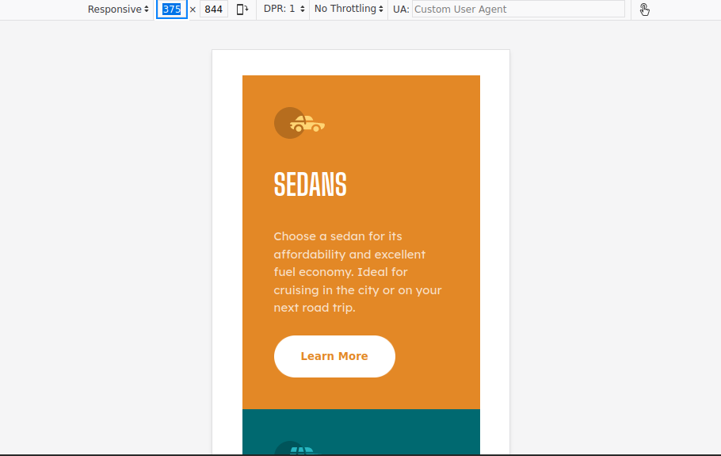
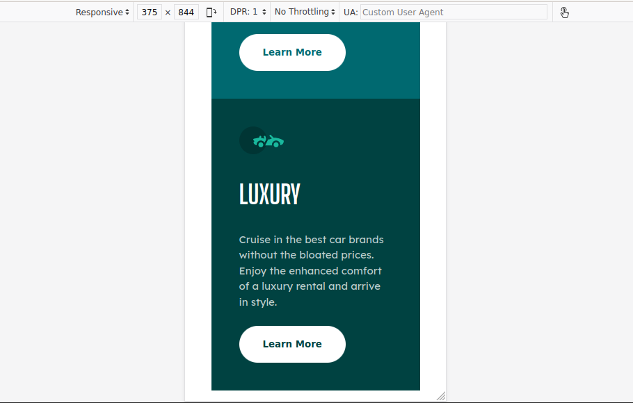
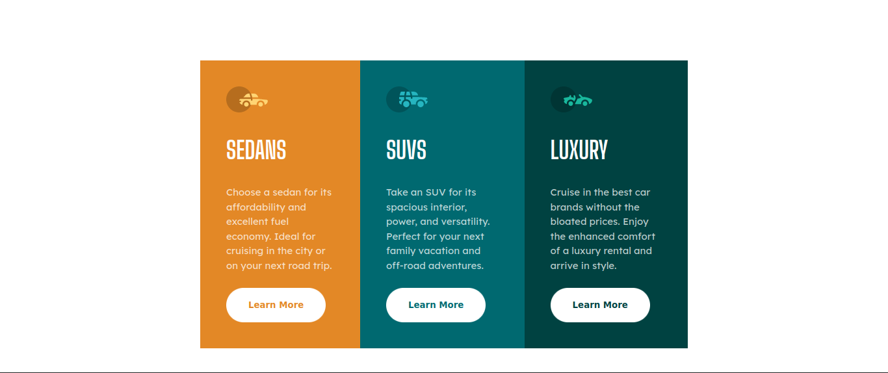
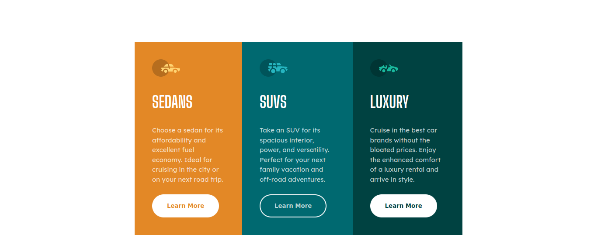

# Frontend Mentor - 3-column preview card component solution

This is a solution to the [3-column preview card component challenge on Frontend Mentor](https://www.frontendmentor.io/challenges/3column-preview-card-component-pH92eAR2-). Frontend Mentor challenges help you improve your coding skills by building realistic projects. 

## Table of contents

- [Overview](#overview)
  - [The challenge](#the-challenge)
  - [Screenshot](#screenshot)
  - [Links](#links)
- [My process](#my-process)
  - [Built with](#built-with)
  - [What I learned](#what-i-learned)
  - [Continued development](#continued-development)
- [Author](#author)

## Overview

### The challenge

Users should be able to:

- View the optimal layout depending on their device's screen size
- See hover states for interactive elements

### Screenshot






### Links

- Solution URL: [Frontend Mentor](https://www.frontendmentor.io/solutions/responsive-preview-card-semantic-html-media-query-C_tQQMqkNz)
- Live Site URL: [GitHub Pages](https://teenabobeena.github.io/3-column-preview-card-component-main/index.html)

## My process

### Built with

- Semantic HTML5 markup
- CSS custom properties
- Flexbox
- Mobile-first workflow

### What I learned

I learned how to select several classes with one CSS selector:

```css
#sedan button:hover,
#suv button:hover,
#luxury button:hover {
    background-color: inherit;
    color: inherit;
    cursor: pointer;
}
```
Also I learned how to use 'inherit' to make a button change to the color of the parent element on hover.

## Author

- Website - [GitHub Pages](https://teenabobeena.github.io)
- Frontend Mentor - [@LadyLucyfurr](https://www.frontendmentor.io/profile/ladylucyfurr)
- Twitter - [@chr1st1nac0des](https://www.twitter.com/chr1st1nac0des)
